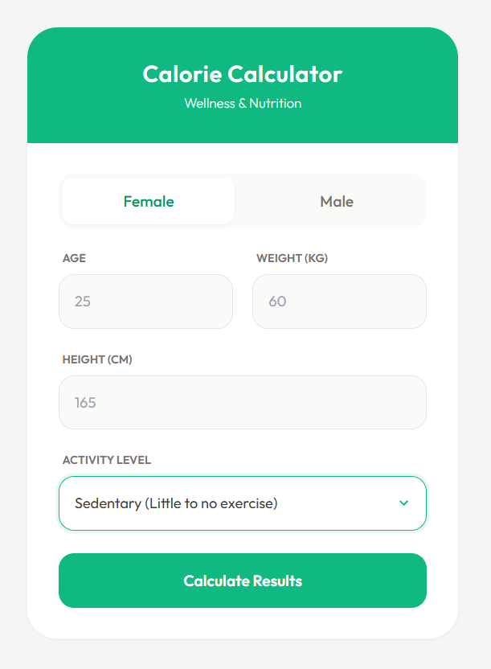

# calorie-calculator
TDEE & BMR Calculator

A clean, aesthetic web application to calculate Basal Metabolic Rate (BMR) and Total Daily Energy Expenditure (TDEE). This tool helps users understand their calorie needs for weight maintenance, loss, or gain.

Features

- Scientific Accuracy: Uses the Mifflin-St Jeor Equation (considered the most accurate standard).
- Responsive Design: Works perfectly on mobile and desktop.
- Modern UI: Built with a soft, rounded aesthetic using Tailwind CSS.
- Instant Results: Real-time calculation without page reloads.

Technologies Used

- HTML5: Semantic structure.
- CSS3 / Tailwind CSS: For the "Modern Soft Sage" styling.
- JavaScript: For the calculation logic and DOM manipulation.

How to Run Locally

- Clone the repository:
git clone [https://github.com/manaal-m/calorie-calculator](https://github.com/manaal-m/calorie-calculator)
- Open index.html in your browser.

How it Works

1. Enter your Age, Weight, Height, and Gender.
2. Select your Activity Level.
3. Click Calculate.

The app displays:
- Maintenance Calories: To stay the same weight.
- Weight Loss: A 500-calorie deficit.
- Weight Gain: A 500-calorie surplus.
